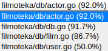
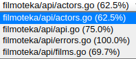

## Оглавление
- [Описание](#описание)
- [Технологии](#технологии)
- [Контакты](#контакты)
- [Deploy](#deploy)
- [Окружение](#окружение)
- [ToDo](#todo)
- [ТЗ](#тз)
- [Тестирование](#тестирование)
---

## Описание
Сервис, который позволяет получать информацию о фильмах и актерах из БД. Поддерживает создание изменение и удаление фильмов и актеров с ограничение по статусу пользователя. Так же есть возможность сортировки выдачи фильмов и поиск.

## Технологии
* **Lang**  -   Go
* **DB**  -  PostgreSQL
* **Docs**  -  Swagger
* **Deploy**  -  docker | docker-compose

## Окружение
**CONFIG_PATH** - путь до конфиг файла при локальной разработки

## Deploy
0. Настроить config файл, docker-compose
1. ``` sudo docker buildx build -t filmoteka -f Dockerfile . ```
2. ``` sudo docker-compose up ```

## Контакты
Аноховская Софья anokhovskaya.s@gmail.com


## ToDo
* Сделать возможность поиска по полю **actors** ```GET /films```
* Убрать из response json повторяющиеся поля для ex: запрос ```GET /films``` в ответе есть поле **actors** и у каждого элемента снова поле **films** *(films у actor надо убрать в данном случае)*
* Расширить тесты для проверки запросов с параметрами сортировки и поиска
* Refact реализации через interfaces
* Доработка примеров запросов и ответов в документации 

## Тестирование
* Все тесты находятся в папке ```/tests```

* Что бы запустить тесты должн быть описан config файл в папке ```./tests/config```, а так же создана **db-test**




### Запустить тесты:
из папки ```./filmoteka/tests```

```go test  -coverprofile=cover.out -coverpkg ../api```

### Посмотреть % покрытия:

```go tool cover -html=cover.out```

## ТЗ
