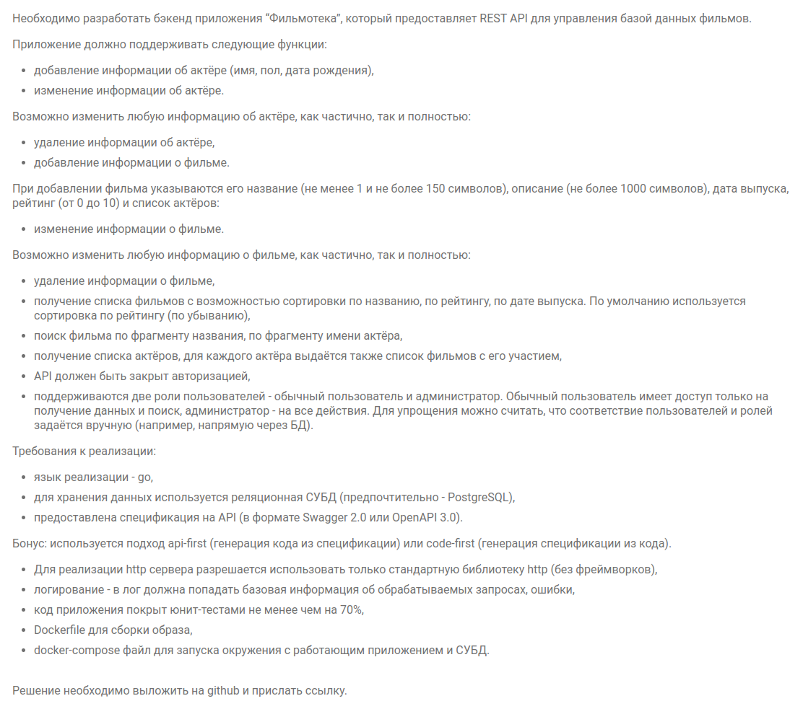

## Оглавление
- [Описание](#описание)
- [Технологии](#технологии)
- [Контакты](#контакты)
- [Deploy](#deploy)
- [Окружение](#окружение)
- [ToDo](#todo)
- [ТЗ](#jira)
- [Важное](#важное)
---

## Описание
Сервис, который позволяет получать информацию о фильмах и актерах из БД. Поддерживает создание изменение и удаление фильмов и актеров с ограничение по статусу пользователя. Так же есть возможность сортировки выдачи фильмов и поиск.

## Технологии
* **Lang**  -   Go
* **DB**  -  PostgreSQL
* **Docs**  -  Swagger
* **Deploy**  -  docker | docker-compose

## Окружение
**CONFIG_PATH** - путь до конфиг файла при локальной разработки

## Deploy
0. Настроить config файл, docker-compose
1. ``` sudo docker buildx build -t filmoteka -f Dockerfile . ```
2. ``` sudo docker-compose up ```

## Контакты
Аноховская Софья anokhovskaya.s@gmail.com


## ToDo
* Сделать возможность поиска по полю **actors** ```GET /films```

## ТЗ
